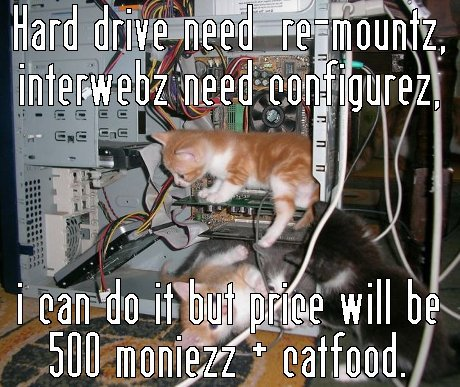

# Task 3

## Halt excessive API usage

One of your colleagues, Bob, made an automatic collection script to retrieve data from a world-leading SaaS solution. However, the API usage is billed per call and expenses run rampant. The script needs to be stopped ASAP. Fortunately for Bob, but unfortunately for you, Bob is enjoying his holiday. All you know is that Bob's script runs somewhere on a server as a cron job.

Stop Bob's script! Although even better would be to just limit the frequence of his script to execute once every hour during office hours.

Also, find and retrieve the picture of Bob's cats.

Details;
```
server address   : 95.179.138.59
ssh port         : 22
user             : bob
password (of Bob): Bob@SuperS3cret
```


## How-to

- Access the server via ssh and given credentials `ssh bob@95.179.138.59 -p 22`
- Identify a running cron job `crontab -l`
- Reconfigure it to run every hour during weekdays from 9 to 17: `crontab -e` and substitute schedule to `0 9-17 * * 1-5`
- find a cat image `ls`
- Exit the server and `scp bob@95.179.138.59:cat.jpeg src/task3/`


## Results


